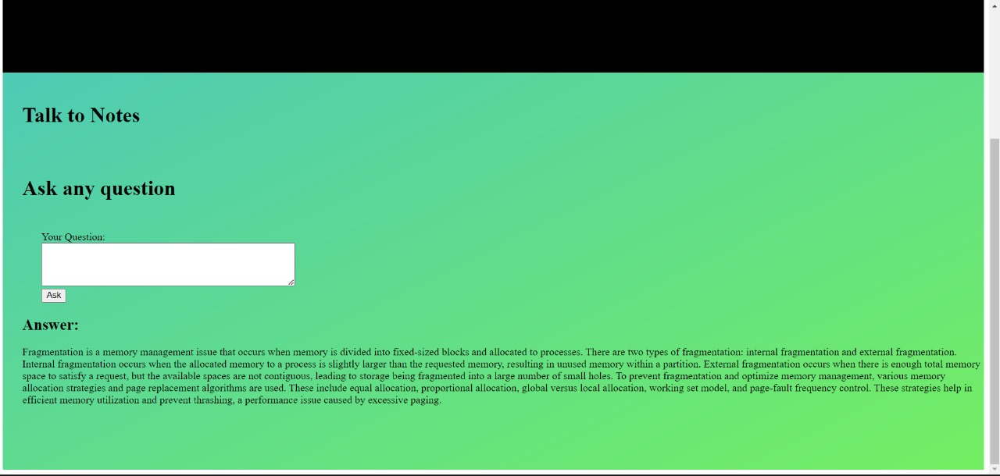

# EduEvolveAI_InnovoHackathon
A student development engine, built for the InnovoQuest 2024 hackathon.

# EduEvolveAI

Introducing EduEvolveAI, the ultimate student companion. A platform for efficient productivity tracking, multilingual meeting assistance, and engaging in insightful content discussions with our intelligent our all-in-one solution for efficient learning.

Our model revolutionizes the student learning experience by seamlessly integrating several powerful features. Firstly, it offers a swift and efficient way to navigate through complex concepts and clarify doubts by directly querying students' notes. This eliminates the need for external guidance, putting the power of knowledge at students' fingertips.

Moreover, our Q&A-based model goes beyond traditional learning methods. It not only generates insightful questions from study materials but also evaluates students' responses. By replacing incorrect answers with the right ones, it actively contributes to the learning process. Mistakes are documented, allowing for the identification of weak areas, which are then utilized to tailor a personalized learning experience for improvement. This robust student assessment bot transforms learning into a dynamic and adaptive journey.

OUr model ALSO extends its support to alleviate the challenges students face when drowning in a sea of extensive documents. The summarization feature analyzes and condenses voluminous content into bite-sized summaries. This not only saves valuable time but also ensures that crucial information is efficiently delivered to students.

In essence, our Q&A-based model is meticulously designed to empower students to test and enhance their skills, overcome weaknesses, and achieve overall improvement. By generating questions from provided materials, evaluating responses, and documenting mistakes as areas of weakness, it contributes to insightful profile development. The information gathered is then utilized to craft tailored learning experiences, strengthening identified weaknesses and fostering comprehensive academic growth.

## Features

- Learning Assistant- An intelligent, personalized chatbot designed exclusively for students, Learnin Assistempowers learners to interact seamlessly with a dynamic knowledge base. Students can effortlessly clarify doubts with contextual responses, ensuring a tailored learning experience.
- Student Assessment- Here we evaluates learners through quizzes. The comprehensive analytics generated are shared with teachers, providing valuable insights. Additionally, the personalized assistant aids students by delivering targeted notes in areas where they may need reinforcement.
- Contextual Summarizer- It  is a game-changer for students during crunch time. It condenses extensive notes, whether in PDF or text formats, into concise summaries. Makes for efficient revision, allowing students to understand concepts swiftly.
- Notes creator -This tool facilitates the creation of organized and easy-to-understand video notes. Transcribes and summaizes video content, promoting a deeper understanding of complex subjects over multimedia.
- Talk to notes -  Interacting with vast amounts of data has never been more accessible. The TalkToNotes Engine enables students to engage in conversations with their data, making complex information retrieval a breeze. This feature ensures quick understanding and retrieval of information.

## Tech Stack

Then install the following libraries
python
Python libries:
- langchain
- flask
- gradio
- spacy
- PyPDF2
- pandas
- sys
- fuzzywuzzy

You also require API keys for the following
- Openai-3.5-turbo
- GeminiAI
- Youtube_data_api

## Authors

- [@SayliJain](https://github.com/SayliJain)
- [@RatanRavichandran](https://github.com/RatanRavichandran)
- [@codekid211](https://github.com/codekid211)

## Screenshots
- The home UI

- UI for the Learning Assistant-

- TUI for Student Assessment 

- UI for Video Summrizer and notes creator

- Text Summrizer

- Querying your notes 
 

- This is the result of Querying your notes
 

